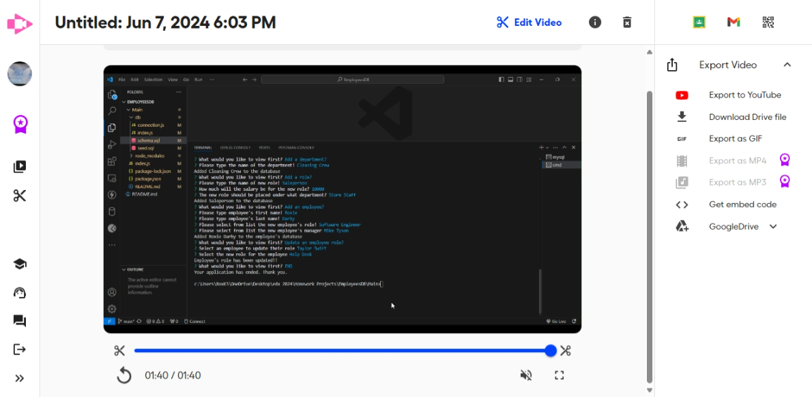

# EmployeesDB
Create an emoloyee database. I want to show each department and every person over that department. I want to also show the salary of each employee within that department. After doing node index.js, I am asked a series of questions to show information about the tables that I have created. I am able to add and delete an employee. I can change the employee title if needed. 

install npm i inquirer@8.2.4
npm install
node index.js

https://github.com/RoxD90/EmployeesDB

https://roxd90.github.io/EmployeesDB/

https://drive.google.com/file/d/1M-8bpNZT4P1gfFAxqCXg8t8sJqugdUt6/view?usp=sharing

